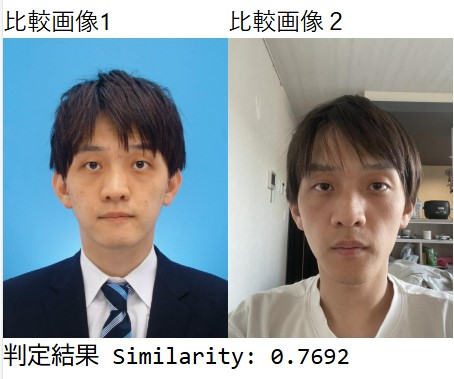

"# face_detect_imperfect"

## 概要

顔写真不備検出用アプリサンプル標準化
顔写真の不備を検出できるようにするアプリの標準化
まずはマスクの検出～

## frontend

開発言語：Typescipt
フレームワーク：Next.js
バージョン：package.json を参照

## backend

実現方式：RESTAPI
開発言語：Python
フレームワーク：Flask
環境：python3.12 の env 環境
OS：Windows11 or Ubuntu

（注意）
face_mask_detection をファイチューニングや学習をさせたい場合、Python の環境は 3.913 である必要がある。
また pip install -r requirement.txt でパッケージをインストールしても、スクリプト流しながら手動でインストールした。
