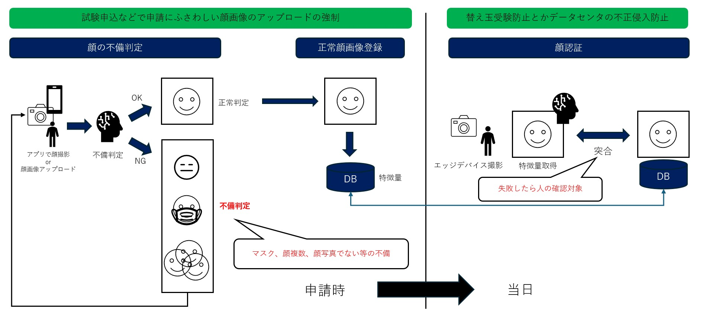
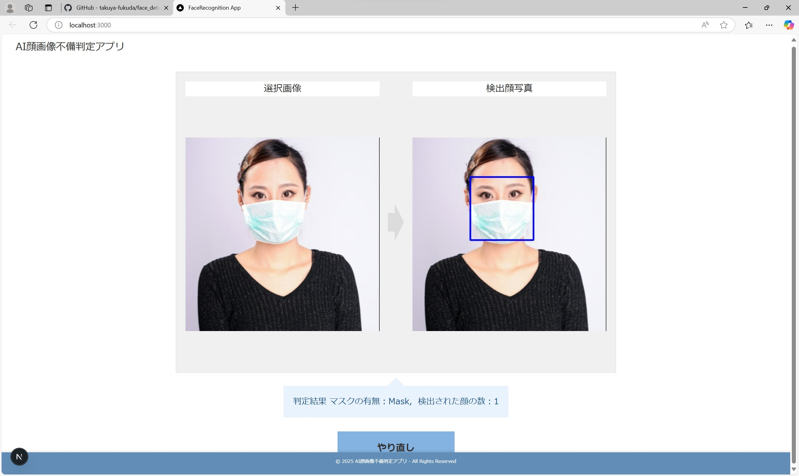

"# face_detect_imperfect"

# 概要

顔写真不備検出用アプリサンプル標準化
顔写真の不備を検出できるようにするアプリの標準化

拡張予定機能  
・表情分析機能  
・眼鏡検出機能  
・顔の類似度比較（替え玉受験対策）

# サービスイメージ例

# 現在できること

・マスク判定  
・顔の有無判定  
・顔の複数有無  
・顔の類似度比較

### 申込アプリイメージ

### 試験会場やデータセンター

エッジ端末(体温計)とかにカメラをセットして顔の類似度比較  

# frontend

| 項目           | 内容                |
| -------------- | ------------------- |
| 開発言語       | Typescipt           |
| フレームワーク | Next.js             |
| バージョン     | package.json を参照 |

# backend

| 項目           | 内容                   |
| -------------- | ---------------------- |
| 実現方式       | RESTAPI                |
| 開発言語       | Python                 |
| フレームワーク | Flask                  |
| 環境           | python3.12 の env 環境 |
| OS             | Windows11 or Ubuntu    |

（注意）

# 顔検出に使用した AI モデル

MediaPipe が簡単そうなので、使用。 ランドマークたくさん取得してたり、今後顔の傾きとか不備判定の点で利用できると思った。  
単に顔検出という観点であれば、顔認証系のモデルの方がいいと思う。

https://ai.google.dev/edge/mediapipe/solutions/vision/face_detector/python?hl=ja&_gl=1*gtsxxq*_up*MQ..*_ga*NTAzNjA0MjA3LjE3NDU1ODMxNzU.*_ga_P1DBVKWT6V*MTc0NTU4MzE3NC4xLjAuMTc0NTU4MzIwOC4wLjAuNDEyNDIwMTQ3

# Mask 判定に使用した AI モデル

https://github.com/Karan-Malik/FaceMaskDetector  
face_mask_detection をファイチューニングや学習をさせたい場合、Python の環境は 3.913 である必要がある。
また pip install -r requirement.txt でパッケージをインストールしてもエラー出るので、スクリプト流しながら手動でインストールした。

# 顔類似度判定に使用した AI モデル

モデル名：edgeface  
https://github.com/otroshi/edgeface/tree/main

最近の顔認証の PaperWithCode を読んだ限りでは、GhostFaceNet を使用するべきだが、学習済みモデルがおいていないので
今後実装。

# コーディング規約

◎ オブジェクト指向に関して  
基本的に単一で処理が終わるものに関しては,関数ベースを使用  
複数の関数が同じデータを使う場合、再利用したい処理が増えてきた場合等に Class を使用すること

◎ ライブラリのインポート  
不要なライブラリのインポートは処理速度の低下を招くので避ける

◎ フロントエンドの use client と server の使い分け  
基本的には、DB 操作など、フロントエンドでアルゴリズム等が公開されては行けない処理はサーバコンポーネントとして扱う  
特にアルゴリズムの公開が問題ない部分に関しては usestate などの状態管理を使用し、サービスを実現する。

◎ フロントエンドのコンポーネント管理  
なるべく再利用が可能なものはコンポーネントで部品化をおこなう  
なおソースコードがあまりにも長くなっているなど可読性を下げるような部分に関しては、hooks などの利用も検討すること

◎ バックエンドの処理方式に関して  
今回は AI による推論の API なので、推奨されるデザイン設計にしたがって、  
下記の処理フローがしっかりわかるような記載になっていること

・前処理  
・推論  
・後処理
